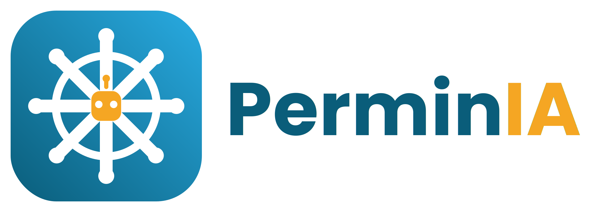
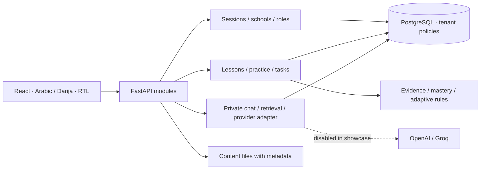

<p align="center"></p>

# PerminIA — driving-school learning, built around the learner

A technical MVP for Moroccan driving schools: a connected learner, instructor and school-manager experience, with Arabic/RTL navigation and Moroccan Darija explanations.

**[Try the live interactive demo](https://perminia.vercel.app) · [CI checks](https://github.com/hajjoub-abdelkabir/perminia/actions)**

**Status: demonstrable technical MVP, with a live frontend presentation and a full local Docker application. Not an accredited curriculum or a production-ready commercial service.** The public showcase uses original synthetic shape/color exercises and fictional accounts. The private imported driving-question bank, audio/video collections, credentials and database backups are not distributed.

## What you can try in the full local application

- Sign in as a learner, instructor or school manager, with school-scoped access.
- Read lessons progressively, save reading progress and bookmarks, and resume later.
- Take a timed practice session: server-side deadlines, saved selections, explicit confirmation, resume and end-of-session review.
- Explore the baseline mastery/adaptive engine using clearly labelled synthetic evidence. Repeated question-family evidence is limited; this is not a validated prediction of driving ability.
- Assign a lesson, complete it as the learner, and see its status as the instructor.
- Manage invitations, student–instructor links and account recovery.

The code also contains a Darija chat assistant with per-conversation memory, local text retrieval, source checks, OpenAI/Groq adapters and request quotas. **AI is disabled in the public showcase**: no provider key, network call to an AI service or paid account is required. AI tests mock the providers. The development integration has been exercised separately; educational validation and school-level monetary budgets remain future work.

## Quick start

### Browser-only portfolio demo (Vercel)

Open **https://perminia.vercel.app**. Start as the learner, read a walkthrough and complete its task, then switch to the instructor to inspect it and assign another. The manager view illustrates student assignment. No installation or sign-in is needed.

The public-demo build is a separate, self-contained presentation of the product. Switch between learner, instructor and manager without signing in. Reading, tasks and the short illustrative quiz share namespaced localStorage; reset affects only this demo. If storage is unavailable it falls back to memory. Chat responses are explicitly labelled, prewritten examples, not live AI. No real school data is requested or sent.

```sh
npm ci --prefix student/frontend
npm run build:demo --prefix student/frontend
python scripts/check_static_demo.py
python -m http.server 5190 --bind 127.0.0.1 --directory student/frontend/dist
```

Open `http://localhost:5190`. The browser-only entry point excludes backend API clients from its bundle. Its timer and scoring are local simulations; server-side guarantees described for the Docker application do not apply to this presentation.

For Vercel select **Vite**, root `student/frontend`, command `npm run build:demo`, output `dist`. The checked-in `vercel.json` sets the build/output configuration. No API keys or DB variables are needed. `vite --mode public-demo` sets the static-demo entry point at build time; the existing default build continues to run the full API-backed interface.

### Full local application (Docker)

Requirements: Docker Desktop with Linux containers (or Docker Engine + Compose v2+), Python 3.10+, and an available local port **5184**. The first build downloads dependencies; an internet connection is required.

```sh
python scripts/showcase.py start
```

Open **http://localhost:5184**. Generated logins are saved only on your machine in `data/showcase/accounts.json`. Choose the account whose `role` is `student`, `instructor` or `school_manager` in the same school. Do not publish that file or show passwords in a recording.

The launcher creates a separate Docker project `perminia-showcase-<checkout-id>`, a fresh PostgreSQL volume, two fictional schools, six sign-in accounts, eight synthetic exercises and two original walkthrough lessons. Each checkout has its own project/volumes; keep its path stable to reuse them. It applies migrations and configures the limited runtime DB role before starting the API. The React production build is served by FastAPI; there is no Vite development server or API reload in this showcase.

```sh
python scripts/showcase.py status
python scripts/showcase.py test
python scripts/showcase.py stop
```

Stopping preserves data. Re-running `start` preserves existing accounts and progress. Seeding refuses non-showcase/non-test databases and nonempty unrelated data; it never republishes imported questions. If a database or credential file is lost independently, restore the matching pair or create a separate fresh checkout/environment; the launcher deliberately does not reset accounts silently.

To run two checkouts at once, use `python scripts/showcase.py start --port 5185` for the second one. Use the same port argument on subsequent starts; the default is 5184. Only projects created by this launcher are operated on.

**Local only:** the sole published port binds to `127.0.0.1`. The database has no host port. This setup uses local HTTP; do not expose it publicly or put real learner data in it. See [security and deployment boundaries](SECURITY.md).

## A five-minute walkthrough

1. Log in as an Atlas learner; open the assigned walkthrough lesson and finish its three paragraphs.
2. Confirm task completion in **اليوم**. Open **التعلّم والتدريب → السلاسل**, take the synthetic exercise, and confirm each answer within 30 seconds.
3. Open **تدريباتي المحفوظة** to inspect the saved session and evidence. The content is deliberately not a Moroccan driving-law assessment.
4. Log out and enter the matching Atlas instructor account. Inspect the learner, reading progress and completed task; assign another lesson.
5. Log in as the Atlas manager to inspect school membership and links. The Rif school is separate and provides an isolation scenario.

Detailed [demo script and release checklist](docs/public/SHOWCASE.md).

## Architecture



This is a modular application, not a claim of independently deployed microservices. Deterministic code controls scoring, deadlines and permissions. Generative AI explains; it does not determine answer correctness or grant access.

| Location | Purpose |
|---|---|
| `student/frontend/src` | Learner and staff UI, lessons, timed practice, chat |
| `student/backend/app` | API, authentication, school workflows, learning and AI modules |
| `student/backend/schema`, `migrations` | Versioned PostgreSQL schema and migrations |
| `student/backend/tests` | Disposable-database integration and unit tests |
| `seed_showcase.py` within backend | Strictly isolated synthetic fixtures |
| `scripts/showcase.py` | Cross-platform local demo lifecycle |
| `scripts/prepare_public_release.py` | Allowlisted export and credential-pattern checks |

Pinned project dependencies include React 19.3.0, Vite 8.3.0, FastAPI 0.141.1 and PostgreSQL 17.11; container bases are digest-pinned. See the lockfiles for the complete dependency set.

## Verification

```sh
npm ci --prefix student/frontend
npm test --prefix student/frontend
python scripts/prepare_public_release.py --check
python scripts/showcase.py start
python scripts/showcase.py test
```

The publishable suite exercises login/session boundaries, CSRF, synthetic fixture guards, practice timing/resume/idempotency, answer-key protection, mastery rules and mocked chat isolation/quotas. Some legacy import/media tests require the private dataset and are intentionally outside this public suite. A GitHub Actions workflow runs the public checks on pushes and pull requests; a local pass does not claim that a remote workflow has already run.

## Roadmap and honest limits

Next: reviewed/licensed Moroccan category-B content; an end-to-end diagnostic-to-targeted-practice journey; instructor concept-level interventions; broader AI evaluation and monetary budgets; then staging, HTTPS, off-device restore drills and a supervised school pilot.

Not yet claimed: comprehensive official exam coverage, proven learning improvement, pass-probability prediction, 10,000-user capacity, practical-lesson voice notes, subscriptions/payment automation, or production readiness.

This repository presents an engineering milestone and a reproducible product demonstration. It does not present synthetic scores as real students' achievements.

## Attribution and reuse

See [third-party notices](THIRD_PARTY_NOTICES.md). Included icons retain their MIT notice. Brand assets identify this project. No blanket open-source license has been chosen for the original application code; public visibility alone does not grant a general reuse license. Dependency and third-party asset licenses remain applicable.

بالدارجة: هادي نسخة تقنية قابلة للتجربة. المشروع كيبني طريق من التعلم للتدريب والمتابعة؛ اعتماد محتوى البيرمي وتجربته مع مدرسة حقيقية هما المرحلة الجاية.
